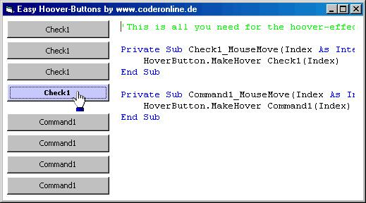

<div align="center">

## OnMouseOver Hoverbuttons only need one line of code to work\- keep your code clearly with this


</div>

### Description

To improve the look of your application you might wish to have hooverbuttons.

-You think you'll need many codelines for each button and so many lines would make your code unclearly for you?

&gt;&gt; Download the solution for your problem here. You'll only need one line of code to make a Command-button, Checkbox-Button or even a picturebox being your individual Hooverbutton!

I really hope you like my solution! I have searched the internet for so long to find a solution like this- But there is none!

So please support my work and vote for me. thx!
 
### More Info
 


<span>             |<span>
---                |---
**Submitted On**   |2005-08-31 00:12:24
**By**             |[Max Christian Pohle](https://github.com/Planet-Source-Code/PSCIndex/blob/master/ByAuthor/max-christian-pohle.md)
**Level**          |Advanced
**User Rating**    |4.7 (61 globes from 13 users)
**Compatibility**  |VB 4\.0 \(16\-bit\), VB 4\.0 \(32\-bit\), VB 5\.0, VB 6\.0
**Category**       |[Miscellaneous](https://github.com/Planet-Source-Code/PSCIndex/blob/master/ByCategory/miscellaneous__1-1.md)
**World**          |[Visual Basic](https://github.com/Planet-Source-Code/PSCIndex/blob/master/ByWorld/visual-basic.md)
**Archive File**   |[OnMouseOve1928768312005\.zip](https://github.com/Planet-Source-Code/max-christian-pohle-onmouseover-hoverbuttons-only-need-one-line-of-code-to-work-keep-your-__1-62388/archive/master.zip)

### API Declarations

```
included in zip-file:
uses GetCursorPos, WindowFromPoint, SetTimer and KillTimer-API
```


